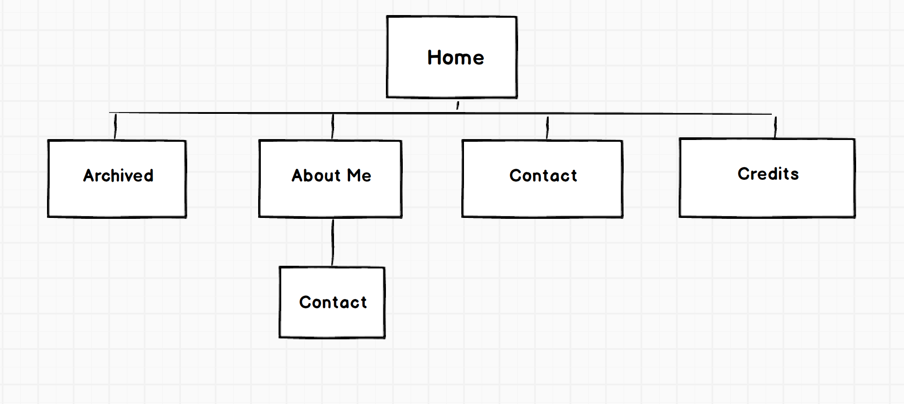

#What are the 6 Phases of Web Design?

*Information Gathering
*Planning
*Design
*Development
*Testing and Delivery
*Maintenance

#What is your site's primary goal or purpose? What kind of content will your site feature?

The primary goal of my site is to be a general reflection of myself and ideas. I want to keep it professional, but still feature blog content that can be casual.

#What is your target audience's interests and how do you see your site addressing them?

My target audience's interests would be people who want to learn about programming or even potential employers visiting the site. I plan on posting tutorials or just general facts that I continue to learn.

#What is the primary "action" the user should take when coming to your site? Do you want them to search for information, contact you, or see your portfolio? It's ok to have several actions at once, or different actions for different kinds of visitors.

My main action that I have right now would be for people to read my progress through Dev bootcamp. I hope that I can learn a lot by teaching some of the material that I learn throughough my career.

#What are the main things someone should know about design and user experience?

Keep it simple stupid. I want to have an easy simplistic design that is not cluttered. I want the flow of the site to be very easy and not an eye-strain.

#What is user experience design and why is it valuable?

I want users to want to return to the site because it is simple to use and has valuable information that is clear and concise.

#Which parts of the challenge did you find tedious?

The most tedious part of the challenge was the information collection part. Trying to decide everything that was going to be incorporated into the site.