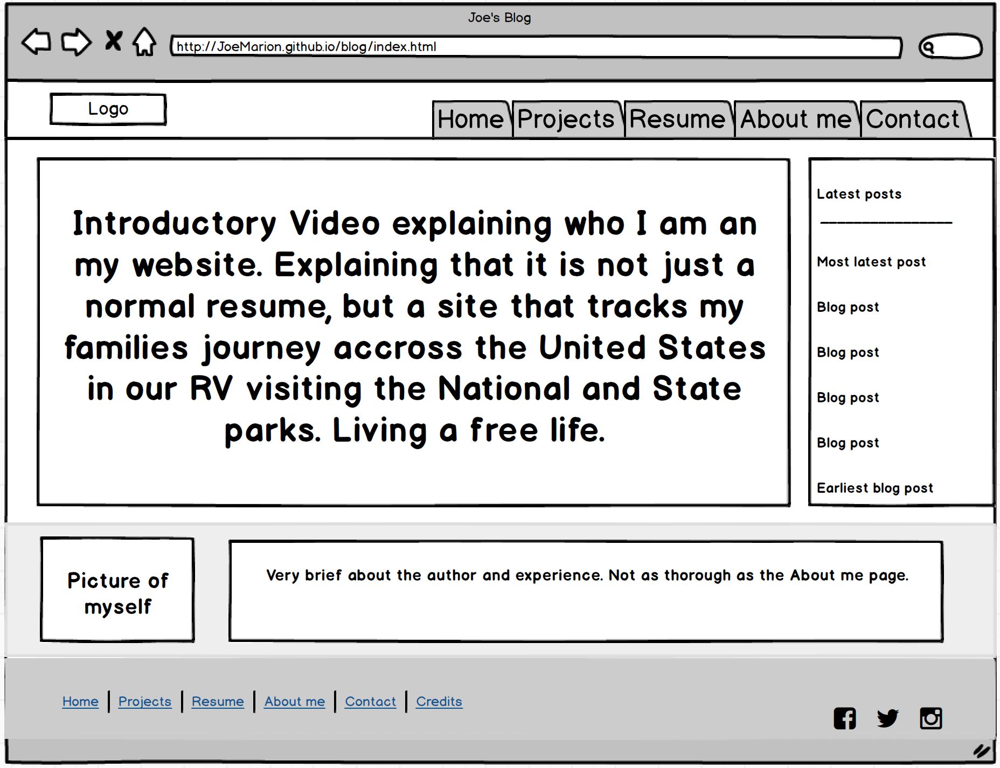

#What is a wireframe?

A wireframe is an outline of how a website is going to look.

#What are the benefits of wireframing?

The benfits of wireframing is the ability to design the site without worrying about the actual code that entails with web design. It allows the user to get an idea of how to layout will look in a timely manner.

#Did you enjoy wireframing your site?

Surprisingly I did. I have done a little bit of HTML before this, but have always struggled with the design. This really helped me get an idea on how to structure my HTML after seeing the layout. I am excited to work with CSS using this new technique.

#Did you revise your wireframe or stick with your first idea?

I had an idea of things I wanted to incorporate into my wireframe without limiting my idea. I them tested certain content in different places until I determined what I liked best.

#What questions did you ask during this challenge?

Most was how to effectively use Balsamiq, but after a couple Youtube videos I felt pretty comfortable with it. I really liked this wireframe software. The other thing that I would want to try would be Illustrator.

#What resources did you find to help you answer them?

I used different Youtube videos that explained how to use Balsamiq and the benefits of using a wireframe.

#Which parts of the challenge did you enjoy and which parts did you find tedious?

I enjoyed the whole process! I didn't find it tedious because the last time I tried to make a website it was much more tedious to build without a wireframe.