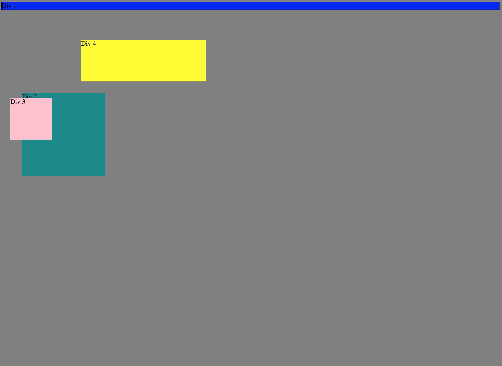
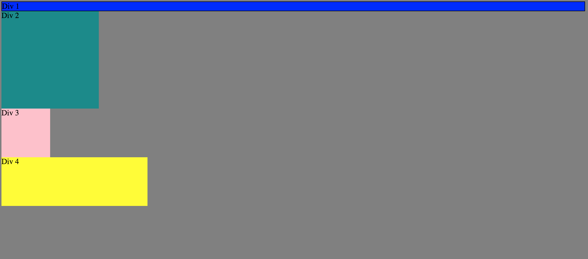
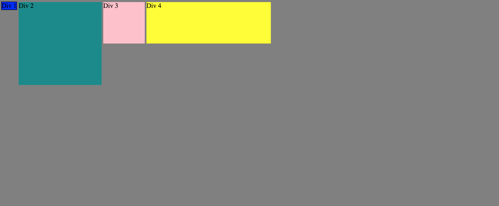
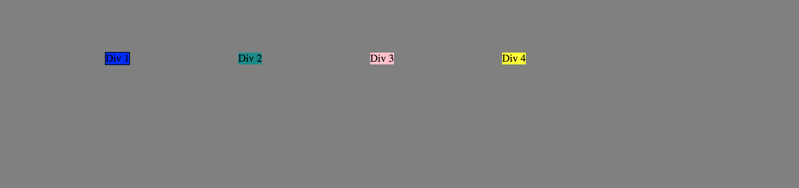
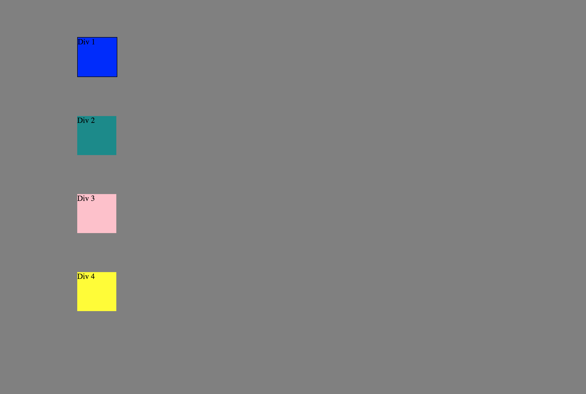
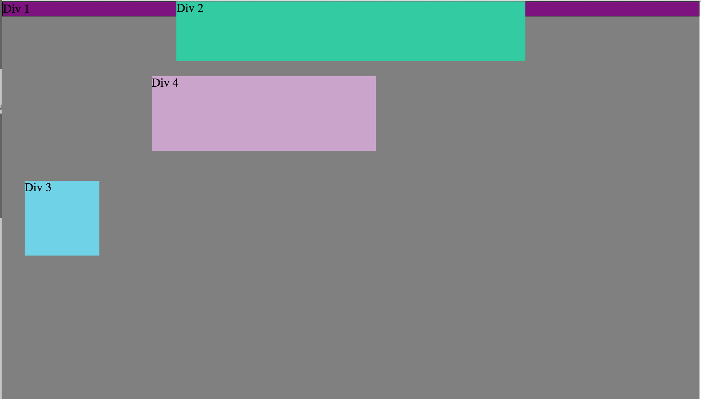
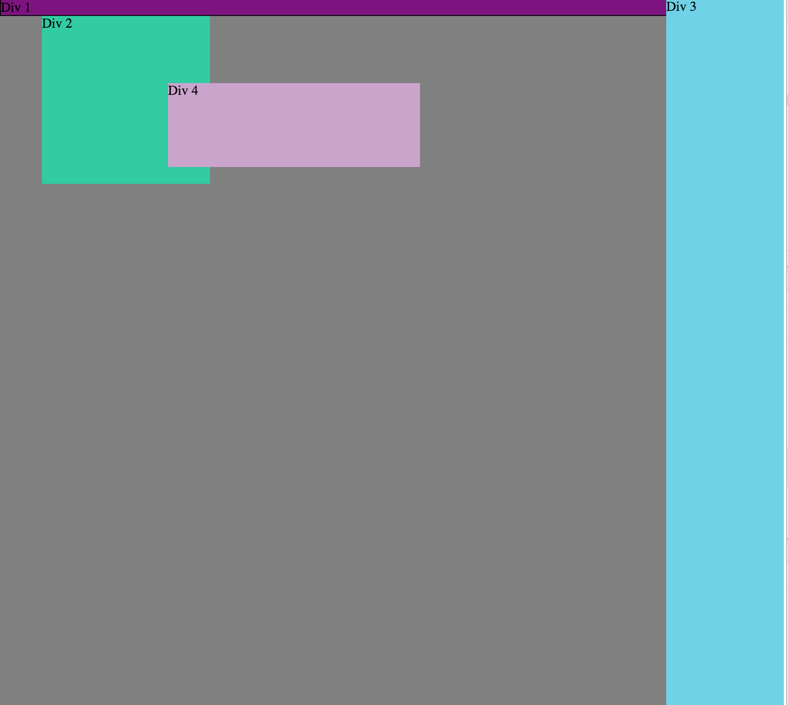
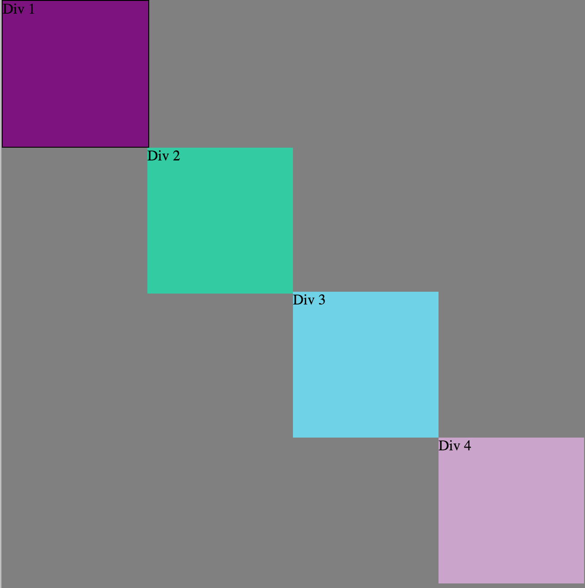

#How can you use Chrome's DevTools inspector to help you format or position elements?

Modifying the styles section of Chrome's DevTools gives you realtime updates on how the CSS is effecting the page. I doesn't save the changes, but it is a quicker way to see if your code modifies the content the way you intend.

#How can you resize elements on the DOM using CSS?

You can resize elements on the DOM using CSS by selecting the element you would like to change within the CSS file, then editing the size of the specific element.

#What are the differences between Absolute, Fixed, Static, and Relative positioning? Which did you find easiest to use? Which was most difficult?

Static lets the element use normal behavior, but top, right, left, and z-index properties do not apply.

Absolute positions at a specific position relative to its closest positioned ancestor or containing block. Absolutes do not collapse with any other margins.

Fixed is positioned relative to the screen's viewport and doesn't move when scrolled.

Relative lays out all elements as though the element were not positioned, and then adjust the element's position, without changing layout.

I found the easiest to use position was Absolute and fixed because using properties like top, right, etc were easier to understand. I didn't use relative because it was harder for me to understand how to use it properly.

#What are the differences between Margin, Border, and Padding?

Margin is the area around the outside of the element, border is the "border" of the element, and padding is in between the border and the content of the element. All three of them can be used similarly, but helps manipulate to a greater extend your HTML.

#What was your impression of this challenge overall? (love, hate, and why?)

I liked this challenge because it showed me how to use Chrome's DevTools more. It helped me get a better grasp on how I am going to use CSS for my own projects.