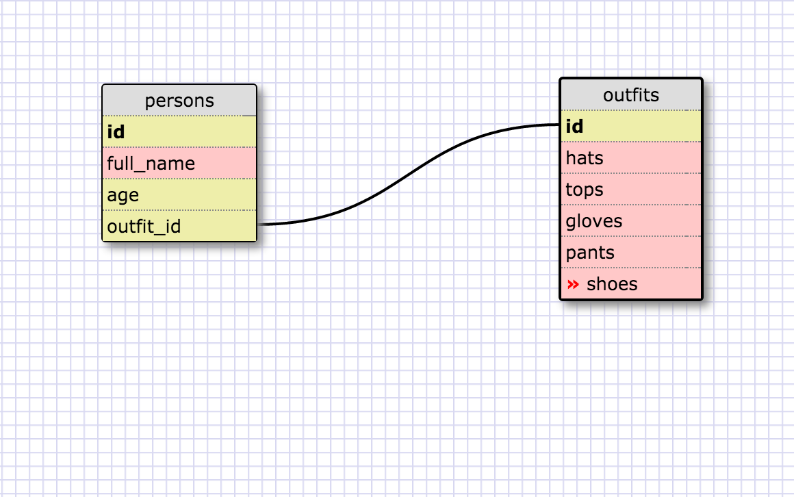

## Select all data for all states.

SELECT * FROM states;

## Select all data for all regions.

SELECT * FROM regions;

## Select the state_name and population for all states.

SELECT state_name, population FROM states;

## Select the state_name and population for all states order by population. The state the the highest population should be at the top.

SELECT state_name, population FROM states
ORDER BY population DESC;

## Select the state_name from the states in region 7.

SELECT state_name FROM states WHERE region_id = 7;

## Select the state_name and population_density for states with a population density over 50 ordered from least to most dense.

SELECT state_name, population_density FROM states WHERE population_density > 50 ORDER BY population_density;

## Select the state_name and region_id for states ordered by region in ascending order.

SELECT state_name, region_id FROM states WHERE 50 ORDERED BY region_id;

## Select the region_name for the regions with "Central" in the name.

SELECT region_name FROM regions WHERE region_name LIKE "%CENTRAL%";

## Select the region_name and teh state_name for all states and regions in ascending order by region_id. Refer to the region by name. (This will involve joining the tables):

SELECT region_name, state_name
FROM states
LEFT JOIN regions
ON states.state_name=regions.region_name
ORDER BY region_id;

#### Images

##What are databases for?

Databases are for storing data, especially for large quantities of it.

##What is a one-to-many relationship?

A one-to-many relationship involves two columns between two tables. It allows the main table to correspond with another column of a related table.

##What is a primary key? What is a foreign key? How can you determine which is which?

A primary key is the first column of the main table in the database. This allows that column correspond with another column. A foreign key is a column of information that exists within both tables.
